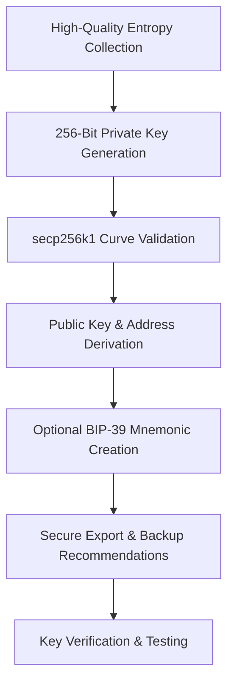

# Bitcoin Private Key Generator

Bitcoin Private Key Generator is a secure entropy sourcing and key derivation engine for creating cryptographically strong secp256k1 private keys and corresponding addresses with proper randomness validation and backup recommendations.

### Introduction to Cryptographic Key Generation Tools

Bitcoin private keys are the foundation of ownership and security in the Bitcoin network. A **Bitcoin Private Key Generator** functions as a specialized **high-entropy random number generation and key derivation engine** that produces secure private keys compliant with Bitcoin’s secp256k1 curve standards.

Developers, security auditors, and advanced users employ these tools to create new wallets with maximum entropy while following best practices for key management and backup.

### Inside the System: Core Mechanism

The generator operates as a **cryptographically secure pseudorandom number generator (CSPRNG) and key derivation layer**. It sources entropy from system sources (hardware RNG, OS entropy pools) and applies:

- Sufficient random bit generation (256 bits for secp256k1)
- Validation against weak key patterns
- Derivation of public keys and addresses (P2PKH, P2SH, Bech32, etc.)
- Optional mnemonic seed phrase generation (BIP-39)
- Secure export and backup recommendations

The process emphasizes true randomness and avoidance of predictable patterns that could compromise security.

### Target Audience and Practical Use Cases

This tool targets:
- Wallet developers and security researchers
- Users creating cold storage or paper wallets
- Auditors testing key generation implementations
- Advanced users setting up multi-signature schemes

Common applications include:
- **Cold wallet creation** for long-term storage
- **Testing key derivation** in custom wallet software
- **Secure address generation** for receiving funds
- **Educational demonstrations** of Bitcoin key mechanics

### Technical Architecture and Operational Logic

A secure Bitcoin Private Key Generator includes:

- **Entropy Sourcing Module**: Hardware and system randomness collection
- **Key Generation Core**: secp256k1 curve operations
- **Validation Layer**: Weak key detection and format compliance
- **Address Derivation**: Multiple Bitcoin address formats
- **Backup & Export Tools**: Secure mnemonic and WIF output

**Operational Logic Flowchart**

### Key Features and Technical Advantages

- **Cryptographically Secure Randomness**: Proper entropy sourcing and validation
- **Multiple Address Formats**: Legacy, SegWit, and Taproot support
- **Mnemonic Integration**: BIP-39 seed phrase generation and verification
- **Security Best Practices**: Recommendations for cold storage and backups
- **Audit-Friendly**: Transparent generation process for verification

The tool prioritizes security and standards compliance over convenience features.

### Where It Fits in the Market: Comparison Table

| Aspect                | Bitcoin Private Key Generator | Online Key Generators | Hardware Wallets     | Basic CLI Tools      |
|-----------------------|-------------------------------|-----------------------|----------------------|----------------------|
| Security             | High (local entropy)         | Low (third-party)     | Highest              | Good                 |
| Ease of Use          | Moderate                     | Very easy             | Easy                 | Technical            |
| Standards Compliance | Full BIP compliance          | Varies                | High                 | Varies               |
| Address Formats      | Comprehensive                | Basic                 | Full                 | Basic                |
| Best Use Case        | Secure key creation          | Quick tests           | Daily use            | Development          |
| Risk Level           | Low (if used properly)       | High                  | Low                  | Moderate             |

### Risk Surface and Limitations

Key generation tools require careful handling:
- **Entropy Quality**: Poor randomness sources can compromise keys
- **Storage Risks**: Generated keys must be stored securely offline
- **Human Error**: Incorrect backup or exposure can lead to fund loss
- **Quantum Threat**: Future quantum computing may threaten ECDSA keys
- **No Recovery**: Lost private keys mean permanent loss of funds

**Critical Optimization Note**: Generate keys offline on air-gapped machines, verify randomness sources, create multiple secure backups, and never share private keys. Consider hardware wallets for long-term storage of significant amounts.

### Deployment Profile and Getting Started

1. **Environment**: Use a secure, preferably offline computer for key generation.
2. **Tool Selection**: Choose reputable open-source or audited generators.
3. **Key Creation**: Run the tool and follow entropy and backup recommendations.
4. **Verification**: Test small transactions to confirm address control.
5. **Secure Storage**: Move keys to hardware wallets or encrypted cold storage.

Community-vetted tools and libraries provide transparent implementations.

### Conclusion

The Bitcoin Private Key Generator provides a secure foundation for creating and managing Bitcoin wallet keys. Its value lies in proper entropy sourcing, standards compliance, and emphasis on secure practices rather than any advanced features. For users who prioritize security and follow best practices for key management, it serves as an essential tool for establishing ownership in the Bitcoin network.

### FAQ

**Is it safe to generate keys with software?**  
Yes, when using reputable tools on secure, preferably offline machines. Hardware wallets offer additional protection for significant holdings.

**Should I use online key generators?**  
No. Online tools introduce third-party trust and potential key compromise risks. Always generate keys locally.

**What is the recommended way to store private keys?**  
Use hardware wallets for active amounts and encrypted, multi-location backups for recovery phrases. Never store keys digitally in easily accessible locations.

**Does it support all Bitcoin address formats?**  
Modern tools support legacy (P2PKH), SegWit (P2SH, Bech32), and Taproot addresses.

**How does it compare to hardware wallet key generation?**  
Software generators are useful for development and testing, while hardware wallets provide superior security for holding significant value through isolated key generation and signing.
